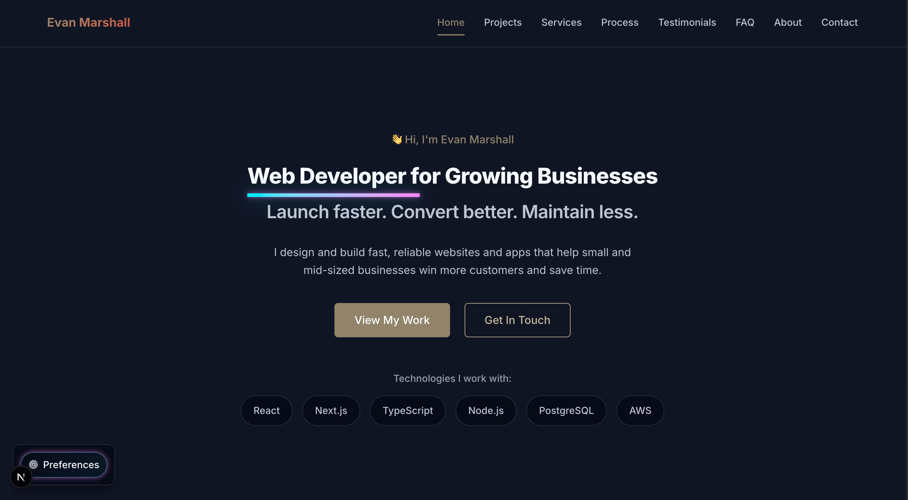

# evanmarshall dot dev


## Live Demo
[](https://www.evanmarshall.dev/)

> **A modern, performant portfolio site to showcase projects, technical skills, and experience. Built with today’s best frontend practices and a scalable, maintainable architecture.**

---



## Overview

**evanmarshall.dev** is a professional developer portfolio and project showcase. This site is designed to highlight technical skills, frontend and full-stack experience, and a commitment to quality, accessibility, and performance. It features a clean, accessible UI, and serves as an ongoing platform for experimenting with CI/CD, testing, and headless CMS integration.

### Core features

- Responsive, accessible design (WCAG 2 AA)
- Projects and skills showcase with live project links
- Fast, SEO-optimized static and dynamic pages
- Typed codebase for reliability and maintainability
- Scalable structure for future features and integrations

---

## Getting Started

### Prerequisites

- Node.js 18+
- pnpm or yarn

### Install and run

```sh
pnpm install
pnpm dev
# or
yarn install
yarn dev
```

Open [http://localhost:3000](http://localhost:3000).

### Scripts

- `pnpm dev` – Start in dev/watch mode
- `pnpm build` – Build for production
- `pnpm start` – Run built app in production

---

## Project structure

```text
.
├── public/
│   └── images/
│       └── site-preview.png
├── src/
│   ├── components/
│   ├── pages/
│   ├── styles/
│   └── utils/
├── .eslintrc
├── .prettierrc
├── next.config.js
├── package.json
├── pnpm-lock.yaml
├── README.md
└── tsconfig.json
```

---

## Technologies used

- **Framework:** Next.js (React, SSR/SSG)
- **Language:** TypeScript
- **Styling:** Tailwind CSS
- **Linting/Formatting:** ESLint, Prettier
- **Testing:** Jest, React Testing Library *(if used)*
- **CI/CD:** GitHub Actions (experimenting with automated build/test/deploy)
- **Deployment:** Vercel
- *(Planned: headless CMS integration, e.g., Contentful, Sanity, or Strapi)*

---

## Configuration notes

- Uses `.env` for environment variables if needed (e.g., analytics, CMS endpoints).
- Static assets live in `/public`.
- Code follows strict linting and formatting for consistency.

---

## Next steps & roadmap

- Integrate a headless CMS for dynamic content management
- Expand project and blog sections
- Add visual theming and dark mode
- Improve automated testing coverage and CI workflows
- Incorporate Lighthouse/axe accessibility reports in CI

---

## License

MIT

---

*Questions, feedback, or collaboration proposals? [Contact via evanmarshall.dev](https://evanmarshall.dev) or open an issue.*
